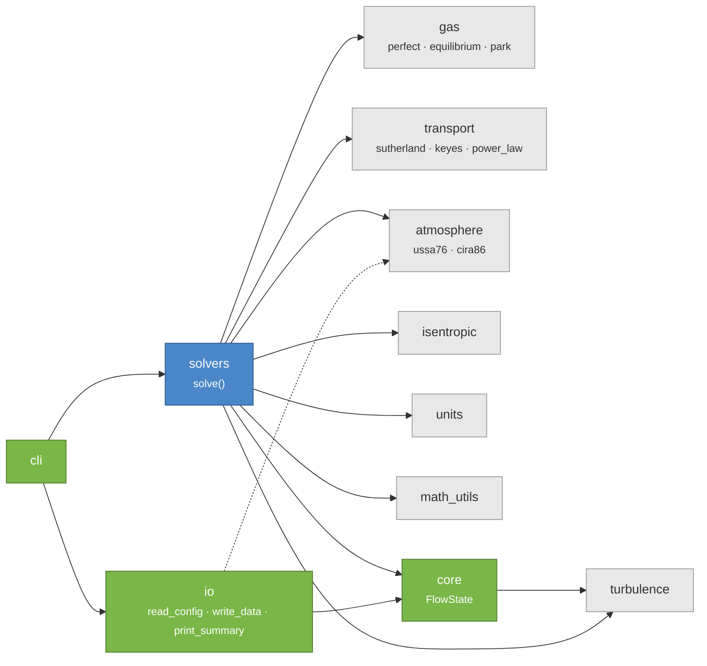

# API Reference

Technical reference for the `flow_state` package.

## Package Architecture

[Download full-resolution module graph (SVG)](../assets/deps.svg){ .md-button download="flow_state_deps.svg" }

## Modules

- [FlowState](core.md): The main dataclass containing flow properties
- [Solvers](solvers.md): The `solve()` function and input combinations
- [Atmosphere](atmosphere.md): Atmosphere models and `AtmosphereState`
- [Transport](transport.md): Viscosity models (Sutherland, Keyes, etc.)
