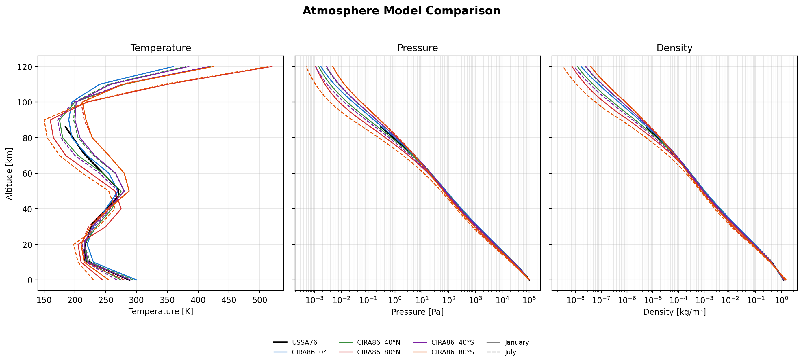
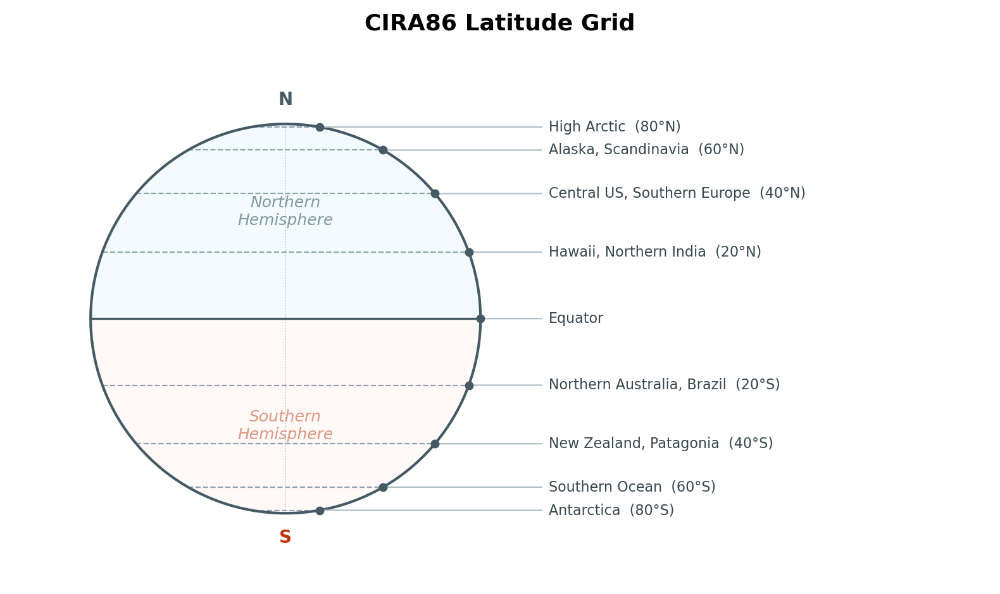

# Atmosphere Comparison

Comparison of the atmosphere models available in `flow_state`, generated using the library itself.

## Model Profiles

The figure below shows temperature, pressure, and density as a function of altitude for:

- **USSA76** — US Standard Atmosphere 1976 (black), valid to 86 km
- **CIRA86** — COSPAR International Reference Atmosphere, shown at five latitudes (0°, 40°N, 80°N, 40°S, 80°S) for January (solid) and July (dashed), valid to 120 km



## Key Observations

- **Temperature**: All models agree in the troposphere (0–11 km). Above ~20 km, CIRA86 shows latitude and seasonal variation — particularly strong in the mesosphere (50–90 km), where polar winter temperatures can drop below 200 K while polar summer temperatures are significantly warmer.

- **Pressure**: Exponential decrease with altitude is consistent across models. Differences are small on the log scale, driven primarily by the temperature profile through hydrostatic balance.

- **Density**: Follows the same exponential trend as pressure. At 80+ km, density is $< 10^{-5}$ kg/m³ — orders of magnitude below sea level.

- **USSA76 vs CIRA86**: At low latitudes and moderate altitudes (< 40 km), USSA76 and CIRA86 are nearly identical. The models diverge most at high latitudes and high altitudes, where seasonal effects dominate.

- **Hemispheric asymmetry**: The Southern Hemisphere polar vortex is stronger than its Northern counterpart — Antarctic winter (80°S Jul) is colder in the stratosphere than Arctic winter (80°N Jan).

## CIRA86 Latitude Grid

Unlike USSA76 (which defines a single reference atmosphere), CIRA86 is parameterized by latitude and month. The model uses tabulated data at 20° increments from 80°S to 80°N, with independent profiles for each hemisphere.



## Reproducing These Plots

The figures were generated with:

```bash
python scripts/generate_atmosphere_plots.py   # T, p, ρ comparison
python scripts/generate_latitude_grid.py       # CIRA86 latitude schematic
```
